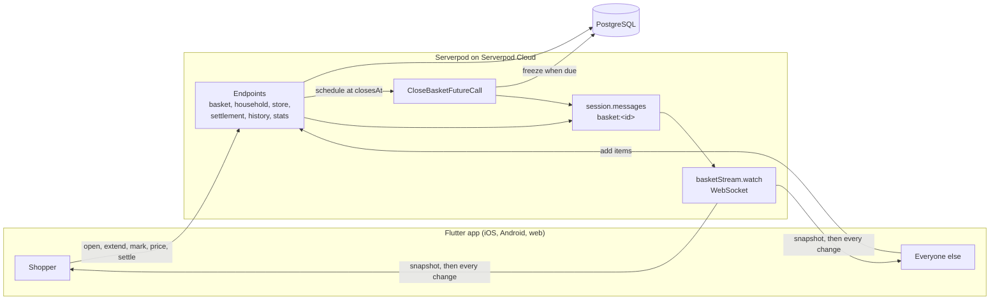

<picture>
  <source media="(prefers-color-scheme: dark)" srcset="docs/brand/open-basket-white-on-black-banner.png">
  
</picture>

**One person shops. Everyone adds.**

A live, time-boxed shared shopping basket for families and housemates, built with Serverpod
and Flutter.

## The problem

Someone is already at the supermarket when the messages start: one in the family group, one in
a private chat, a phone call at the till. Something gets forgotten, and afterwards nobody
remembers who owes whom for what.

## What Open Basket does

1. **The shopper opens a basket** for a store and a few minutes — "checkout in 12 minutes". The
   phone suggests the time from how far away the store is; its location never leaves it.
2. **Everyone in the house adds what they need**, with a note if it matters. Each item appears
   on every phone the moment it is added.
3. **The basket closes itself when the time runs out — on the server**, whether or not any phone
   is awake. The shopper can extend once, by five minutes, and only the shopper.
4. **At the till** the shopper ticks off what they found, enters prices and the receipt total,
   and **the server works out who owes whom**, down to the last kuruş.
5. Every finished run stays in the household's history.

The only thing shared is the remaining time. Live location is never sent to the server.

**Not built:** push notifications. Opening a basket does not yet notify the house; people see it
when they open the app (`docs/TESTING.md` lists what is missing).

## Where Serverpod does the work

| Serverpod feature | What it does here | Why it had to be the server |
|---|---|---|
| **Future calls** | `CloseBasketFutureCall` is scheduled for the deadline when a basket opens, and freezes it then. Idempotent: a call left over from before an extension fires and does nothing. A sweep at startup closes anything a restart lost. | A phone timer dies with the phone. "The basket closes on time" is only true if something that does not sleep closes it. |
| **Streaming** | `basketStream.watch(basketId)` is a WebSocket whose first event is a full snapshot, then every change as it happens, each carrying the server's clock. Endpoints post to a `basket:<id>` channel through `session.messages`. | Items have to land on every phone at once, and a phone that dropped its connection has to resync from the stream itself. |
| **Database and generated client** | 17 `.spy.yaml` models generate the tables, migrations and a typed Dart client. Rule 4 — one open basket per household — is a partial unique index written into the migrations by hand. | Two people tapping *Open a basket* together must not both succeed; only the database can promise that. |
| **Auth** | Serverpod's auth module under a passwordless flow: a six-digit code by email, 10-minute expiry, 3 attempts. On Serverpod Cloud the code is really emailed. | A judge, or a grandparent, can sign in with nothing but an inbox. |
| **Server-side settlement** | Integer minor units per currency; each member owes their own items plus an even share of the receipt gap, remainder to the shopper, so the lines add up to exactly what was paid. A settled run is immutable. | Two phones must never disagree about money. |

Every endpoint checks household membership and role, and every state change writes an
analytics row from the server — the usage report is built from those tables (`scripts/report.sql`).

## Architecture



`docs/ARCHITECTURE.md` records every decision behind this as a numbered ADR, including the
ones that turned out wrong.

## Try it

| | |
|---|---|
| Web (no install) | https://open-basket.serverpod.space/ |
| API | https://open-basket.api.serverpod.space/ |

Sign in with any address you can read mail at. `docs/TESTING.md` is the walkthrough, written
for someone seeing the app for the first time. Point a phone build at the same server with
`flutter run --dart-define=SERVER_URL=https://open-basket.api.serverpod.space/`.

`PLAN.md` is the build plan and status board; `CLAUDE.md` holds the product rules.

---

## Build and run

### What you need

| Tool | Version | Notes |
|---|---|---|
| Flutter | 3.47.4 (stable) | Brings Dart 3.13.3 with it |
| Dart | the one bundled with Flutter | **Not** a separate Homebrew Dart. Serverpod 4 needs >= 3.10.3 |
| Serverpod CLI | 4.0.0 | `dart pub global activate serverpod_cli` |
| PostgreSQL | none to install | Serverpod starts its own PostgreSQL 16 for development |

If `dart --version` reports a Homebrew install, put `<flutter>/bin` ahead of
`/opt/homebrew/bin` in `PATH`.

```bash
git clone https://github.com/KaanCan1/Open-Basket.git
cd Open-Basket
dart pub get                       # one workspace, all three packages
```

### Secrets

`open_basket_server/config/passwords.yaml` is deliberately not in git. Create it from the
template Serverpod generates, or copy this and replace every value with a long random
string of your own:

```yaml
development:
  database: '<the development database password>'
  serviceSecret: '<random>'
  emailSecretHashPepper: '<random>'
  jwtHmacSha512PrivateKey: '<random>'
  jwtRefreshTokenHashPepper: '<random>'

test:
  database: '<the test database password>'
  emailSecretHashPepper: '<random>'
  jwtHmacSha512PrivateKey: '<random>'
  jwtRefreshTokenHashPepper: '<random>'
```

CI passes the same values as `SERVERPOD_PASSWORD_*` environment variables instead.

### Run the server

```bash
cd open_basket_server
dart bin/main.dart --apply-migrations
```

That starts PostgreSQL, applies the migrations and listens on `localhost:8080`. No Docker
is involved.

> If it exits silently right after "Database does not match target state", run
> `./scripts/dev_db_unblock.sh` from the repository root. Development mode treats the
> hand-written rule 4 index as a fatal mismatch; the script drops it from the local
> development database only (ADR-037).

### Run the app

```bash
cd open_basket_flutter
flutter run
```

Sign-in is a six-digit code sent by email. **In development nothing is actually emailed —
the code is printed to the server's console.** Enter the address you want, read the code
out of the terminal running the server, and type it in.

### Run the tests

```bash
cd open_basket_server
dart test                       # unit tests need nothing extra
```

Integration tests need a PostgreSQL **15 or newer** separate from the development one, on
port 9090. Either bring up the container CI uses:

```bash
cd open_basket_server && docker compose up -d postgres_test
```

or, on a machine without Docker, use the script that creates a local cluster on the same
port:

```bash
./scripts/local_test_db.sh start
```

Then:

```bash
cd open_basket_server && dart test
cd open_basket_flutter && flutter test
```

`docs/ARCHITECTURE.md` (ADR-003) explains why the embedded database cannot serve the
integration tests.

### Deploying

The server runs on Serverpod Cloud (ADR-024), which manages every password the auth flow
needs — including the key that actually sends the sign-in email.

```bash
cd open_basket_server
serverpod cloud deploy -p open-basket
```

> **Deploy from a path with no spaces in it.** This repository is usually checked out at
> `.../Open Basket`, and the Serverpod Cloud CLI walks the workspace root, prints it as
> `Open%20Basket` and then reports "No files to upload". It is not a `.gitignore`
> problem and a symlink does not help, because the CLI resolves the physical path. Clone
> to a space-free directory and deploy from there, or rename the checkout.

### After changing a model or an endpoint

```bash
cd open_basket_server
serverpod generate               # models and endpoints -> ORM + typed client
serverpod create-migration       # only when the schema changed
```

> **A hand-written index has to survive every migration.** Rule 4 — one open basket per
> household — is enforced by a partial unique index that `.spy.yaml` cannot express, so
> after `serverpod create-migration` it must be re-added by hand to the new migration's
> `definition.sql` *and* `migration.sql`. See ADR-013. `basket_lifecycle_test` fails with
> instructions if it goes missing.

## Repository layout

```
open_basket_server/    Serverpod backend: models, endpoints, future calls, migrations
open_basket_client/    Generated Dart client. Never edited by hand.
open_basket_flutter/   The Flutter app
docs/                  ARCHITECTURE.md (decisions), CONTEXT.md (status), TESTING.md,
                       DEMO_SCRIPT.md, REPORT.md, SUBMISSION.md
scripts/               local_test_db.sh, dev_db_unblock.sh, report.sql
```
